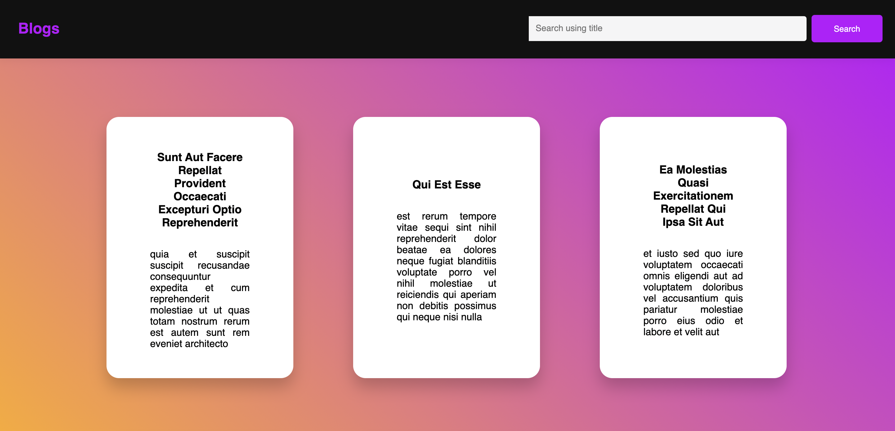

# Blog Post App

A simple blog app which is listing the blogs fetched from a mock endpoint. The application is created using Create React App. It is using Redux for state management.

## How to run

You will need to have Node **10.16.0** or later on your local development machine. You can use [nvm](https://github.com/creationix/nvm#installation) (macOS/Linux) or [nvm-windows](https://github.com/coreybutler/nvm-windows#node-version-manager-nvm-for-windows) to switch Node versions between different projects.
Clone this repository in your Local machine or download the Zip file and then execute the below mentioned steps.

### First install all dependencies

#### npm

```sh
cd blog-post-app && npm install
```

### To start the local server

#### npm

```sh
 npm start
```

### Open app in browser

Once the app is compiled and bundled successfully you should see this screen in your browser. This would be your starting point of the project.


## Instructions

1. Create App ( with CLI only ) and set up a state store (using a UI library is preferred but not mandatory) [ React: CRA & Redux ] Or
   [ Vue: VueCLI & Vuex ]. Make sure the integration API is handled with the store only.
2. Create a Blog posts listing page.
3. Setup a route for a single post page & make sure the blog name should be the page title.
4. Create a button to load comments on a particular post page with this endpoint
5. Perform a search on title bases
6. Serve the app as a production build
